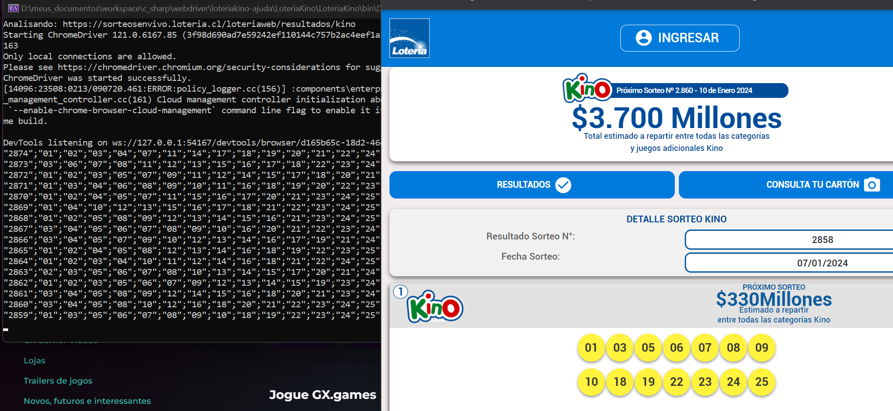

# loteriakino-ajuda
ajuda para colega facebook



# Pré-requisitos

instalar o [dotnet 8.0](https://dotnet.microsoft.com/pt-br/download/dotnet/8.0)

# Executável

- O executável pode ser baixado em: [executável](executavel.7z)

Executar o arquivo: `LoteriaKino.exe`

O arquivo de saída será: `saida.csv`

```
01
02
03
04
07
11
14
17
18
19
20
21
22
24
```

# Urls

- [facebook](https://www.facebook.com/share/p/nVgC9jeemZ9m6MvA/?mibextid=2JQ9oc)
- [sorteosenvivo](https://sorteosenvivo.loteria.cl/loteriaweb/resultados/kino)
- [dotnet 8.0](https://dotnet.microsoft.com/pt-br/download/dotnet/8.0)